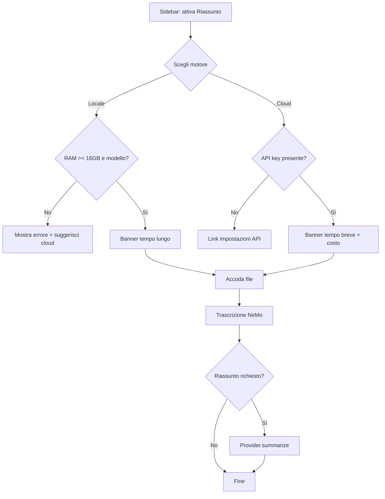

# FIX-RIASSUNTO-LLM — Tracciamento decisionale e roadmap

> **File:** `bug-fix/FIX-RIASSUNTO-LLM.md`  
> **Creato:** 2026-06-28  
> **Aggiornato:** 2026-06-28 (multi-provider + design UI)  
> **Stato:** 📋 Pianificazione — **nessuna implementazione codice** finché non approvato dopo benchmark  
> **Correlato:** `BUG-SUM-019`, `BUG-SUM-020`, `docs/summary-benchmark/`

---

## 1. Executive summary

La feature **riassunto** in Sbobinator **non è accettabile in produzione** nello stato attuale (LexRank + IT5 news). Va **cambiata completamente**.

**Decisioni di principio (utente):**

| # | Decisione |
|---|-----------|
| 1 | Se offriamo riassunto, deve essere **fatto bene** — altrimenti non offrirlo |
| 2 | Motore: **LLM con prompt dedicato** (non modelli news / non LexRank come «riassunto») |
| 3 | **L’utente sceglie chi genera il riassunto** — più margini su hardware e preferenze |
| 4 | Riassunto sempre **opt-in** (costa tempo; su locale costa molta CPU) |

**Provider supportati (target prodotto):**

| ID | Provider | Dove gira | Chi paga / cosa serve |
|----|----------|-----------|------------------------|
| `local` | **LLM locale** (Qwen GGUF) | PC utente, CPU | RAM ≥ 16 GB, modello in `models/` |
| `openai` | **OpenAI** API | Cloud | API key utente |
| `gemini` | **Google Gemini** API | Cloud | API key utente |
| `claude` | **Anthropic Claude** API | Cloud | API key utente |
| `deepseek` | **DeepSeek** API | Cloud | API key utente |
| `kimi` | **Moonshot Kimi** API | Cloud | API key utente |

**Perché multi-provider:** un solo motore non copre tutti gli utenti.

- PC **< 16 GB** o CPU lenta → riassunto **locale non offerto**, ma **cloud sì** (con sua API key)
- Utente **privacy / offline** → **locale**
- Utente che vuole **qualità massima e velocità** → **Claude / GPT / Gemini** (a pagamento)
- Utente che vuole **costo basso** → **DeepSeek / Kimi** o locale

**Blocco esplicito:** nessuna modifica al codice applicativo finché non si completa benchmark (locale + almeno 2 cloud) e approvazione utente.

---

## 2. Cronologia

| Data | Evento |
|------|--------|
| Pre-28/06 | mT5 base → output inutilizzabile |
| 28/06 | IT5 news → ancora insoddisfacente |
| 28/06 | Benchmark LexRank/IT5 → nessun vero riassunto |
| 28/06 | Scelta LLM locale (Qwen), CPU, gate 16 GB |
| 28/06 | Analisi token in input, map-reduce, KV cache |
| 28/06 | **Espansione:** scelta provider multipli (locale + 5 API cloud); design UI |

---

## 3. Stato attuale del codice (da sostituire)

| Componente | Stato | Destino |
|------------|-------|---------|
| `extractive` (LexRank) | Non è un riassunto | Rimuovere dall’etichetta «riassunto» o eliminare |
| `abstractive` (IT5 news) | Qualità inaccettabile | **Rimuovere** |
| `summarize.py` | Monolitico, 2 modalità | Refactor → **provider abstraction** |
| UI sidebar | «Sintesi / Riassunto IT5» | **Selettore provider** + lunghezza + opt-in |

Benchmark di riferimento: `docs/summary-benchmark/runs/20260628_130950/`

**Criteri qualità (invariati):** chi/cosa/contesto, punti principali, autosufficiente, niente invenzioni, niente ribaltamento del senso. Vedi §4 in storico benchmark nel repo.

---

## 4. Architettura multi-provider (backend)

### 4.1 Principio: un’interfaccia, N implementazioni

```
                    ┌─────────────────────┐
                    │   summarize.py      │
                    │   (orchestratore)   │
                    └──────────┬──────────┘
                               │
                    ┌──────────▼──────────┐
                    │  SummaryProvider    │  ← protocollo / ABC
                    │  .summarize(text)   │
                    │  .estimate_tokens() │
                    │  .is_available()    │
                    └──────────┬──────────┘
         ┌─────────┬──────────┼──────────┬─────────┬─────────┐
         ▼         ▼          ▼          ▼         ▼         ▼
    LocalQwen   OpenAI    Gemini    Claude   DeepSeek   Kimi
    (llama.cpp) (API)     (API)     (API)    (API)      (API)
```

**Responsabilità orchestratore:**

1. Conteggio token input (tokenizer appropriato per provider)
2. Scelta strategia **single-pass** vs **map-reduce** (soprattutto locale; cloud spesso contesto ampio)
3. Prompt system + user unificato (adattato leggermente per provider se serve)
4. Gestione errori (API, timeout, OOM locale) → `summary_error` su job
5. **Mai** loggare API key o testo completo in log di produzione

### 4.2 Modulo file proposti (implementazione futura)

| Path | Ruolo |
|------|--------|
| `src/sbobinator/summarize.py` | API pubblica `summarize()`, map-reduce |
| `src/sbobinator/summarize_providers/base.py` | `SummaryProvider`, `SummaryRequest`, `SummaryResult` |
| `src/sbobinator/summarize_providers/local_qwen.py` | llama.cpp / GGUF |
| `src/sbobinator/summarize_providers/openai.py` | OpenAI Chat Completions |
| `src/sbobinator/summarize_providers/gemini.py` | Google Generative AI |
| `src/sbobinator/summarize_providers/anthropic.py` | Claude Messages API |
| `src/sbobinator/summarize_providers/deepseek.py` | DeepSeek (OpenAI-compatible) |
| `src/sbobinator/summarize_providers/moonshot.py` | Kimi / Moonshot API |
| `src/sbobinator/summary_config.py` | Lettura API key, modello default per provider, path locale |
| `scripts/download_summary_llm.py` | Download GGUF Qwen in `models/` |
| `scripts/summary_benchmark.py` | Esteso: `--provider local|openai|...` |

### 4.3 Modello job (campi da aggiungere)

Oggi: `summary_mode`, `summary_length`, `summary_requested`, `summary_error`.

**Proposta:**

| Campo | Tipo | Esempio | Note |
|-------|------|---------|------|
| `summary_provider` | string | `local`, `openai`, `claude`, … | Scelto **all’accodamento** |
| `summary_model` | string | `qwen2.5-3b`, `gpt-4o-mini`, … | Opzionale; default per provider |
| `summary_length` | string | `auto` / `short` / `normal` / `detailed` | Invariato |
| `summary_input_tokens` | int | 984 | Per diagnostica |
| `summary_strategy` | string | `single` / `map_reduce` | Trasparenza |

**Regola:** impostazioni sidebar valgono **solo al momento dell’accodamento** (come oggi). Non modificabili su job già in coda.

### 4.4 Configurazione API key (sicurezza)

| Dove | Cosa |
|------|------|
| **File locale utente** | `data/.secrets/summary_keys.json` o variabili env `SBOBINATOR_OPENAI_API_KEY`, ecc. |
| **Mai in git** | `.gitignore` su `data/.secrets/` |
| **Mai in job.json** | Solo provider id, non la key |
| **UI** | Campo password mascherato in **Impostazioni → Riassunto → API**; salvataggio server-side nel file secrets |
| **Docker** | Env vars nel compose (opzionale) |

Validazione: pulsante «Test connessione» per provider cloud (chiamata minima) prima di accodare.

---

## 5. Matrice provider (studio preliminare)

> Modelli API: nomi indicativi — da confermare al momento dell’implementazione (API evolvono).

| Provider | Modello default proposto | Contesto input ~ | Italiano | Velocità | Costo | Privacy |
|----------|--------------------------|------------------|----------|----------|-------|---------|
| **local** (Qwen 3B Q4) | `Qwen2.5-3B-Instruct` | 8K (`n_ctx` configurabile) | Buono | Lenta (CPU) | Gratis | Massima |
| **openai** | `gpt-4o-mini` | 128K | Ottimo | Veloce | Basso/medio | Cloud |
| **gemini** | `gemini-2.0-flash` | 1M (teorico) | Ottimo | Veloce | Basso | Cloud |
| **claude** | `claude-3-5-haiku` | 200K | Ottimo | Veloce | Medio | Cloud |
| **deepseek** | `deepseek-chat` | 64K | Buono | Veloce | Molto basso | Cloud |
| **kimi** | `moonshot-v1-8k` / `32k` | 8K–32K | Buono (cinese/IT) | Veloce | Basso | Cloud |

**Note strategiche:**

- **Locale:** unico per offline; gate 16 GB RAM; map-reduce per audio lunghi
- **Cloud:** nessun gate RAM per il riassunto; serve rete + API key; contesti grandi → meno map-reduce, più qualità
- **DeepSeek / Kimi:** utili per utenti price-sensitive; benchmark obbligatorio su italiano parlato
- **Claude / GPT / Gemini:** candidati «qualità premium» in UI

### 5.1 Disponibilità per profilo utente (logica prodotto)

```
ALL'AVVIO / PRIMA DELL'ACCODA:

  SE summary_provider == "local":
      SE RAM < 16 GB → DISABILITATO ("Richiede 16 GB RAM")
      SE modello GGUF assente → DISABILITATO ("Esegui download_summary_llm.py")
  ALTRIMENTI SE provider cloud:
      SE API key mancante → DISABILITATO ("Inserisci API key in Impostazioni")
      SE test connessione fallito → WARNING (non bloccare se utente accetta)
```

L’utente con **8 GB RAM** può comunque sbobinare e usare **OpenAI/Claude/…** se ha la key.

---

## 6. Token in input e strategie (tutti i provider)

### 6.1 Perché resta critico

Anche GPT-4 con testo troncato produce riassunti scarsi. Il benchmark deve riportare **token input** per ogni trascrizione.

### 6.2 Stima campioni attuali (~900–2100 token)

Entrano in single-pass per **tutti** i provider (locale 8K compreso).

### 6.3 Audio lunghi (produzione)

| Durata | Token ~ | Locale 8K | Cloud 128K+ |
|--------|---------|-----------|-------------|
| 30 min | 4K–7K | map-reduce o 16K `n_ctx` | single-pass |
| 1 h | 8K–14K | map-reduce obbligatorio | single-pass (quasi sempre) |
| 2 h | 16K–28K | map-reduce multi-step | single-pass o 1–2 chunk |

**Vantaggio cloud:** meno chunk → meno perdita di filo narrativo → **migliore qualità potenziale** su file lunghi.

### 6.4 Map-reduce (condiviso)

```
1. Spezza per frasi/paragrafi (~3K token, overlap 150–200 token)
2. Riassunto chunk (stesso provider)
3. Combina riassunti parziali
4. Se combinato > soglia → riassunto finale
```

Parametri diversi per `local` (chunk piccoli) vs `cloud` (chunk grandi o intero testo).

---

## 7. LLM locale (provider `local`)

Invariato rispetto alla versione precedente del documento, con ruolo di **un provider tra molti**.

| Aspetto | Scelta |
|---------|--------|
| Modello default | **Qwen2.5-3B-Instruct** GGUF Q4_K_M |
| Runtime | llama.cpp / `llama-cpp-python` |
| RAM min | **16 GB** sistema |
| CPU | Sì (fase 1); GPU opzionale fase 2 |
| `n_ctx` default | **8192** |
| Tempi | ~3–8 min (testo medio); fino a 20+ min con map-reduce |

Tier opzionale 7B solo su 32 GB, profilo «qualità lenta».

---

## 8. Design UI (FastAPI + sidebar) — usabilità

> Obiettivo: scelta **chiara** del motore riassunto, senza confusione con la vecchia «Sintesi / IT5».

### 8.1 Struttura sidebar — sezione «Riassunto»

```
┌─────────────────────────────────────────┐
│  RIASSUNTO                              │
├─────────────────────────────────────────┤
│  [✓] Genera riassunto dopo trascrizione │
│                                         │
│  Motore:                                 │
│  ┌─────────────────────────────────┐  │
│  │ ▼ Locale (Qwen) — offline         │  │  ← select
│  └─────────────────────────────────┘  │
│     Opzioni:                            │
│     • Locale (Qwen) — offline, lento    │
│     • OpenAI — richiede API key         │
│     • Google Gemini — richiede API key  │
│     • Anthropic Claude — API key        │
│     • DeepSeek — API key                │
│     • Moonshot Kimi — API key          │
│                                         │
│  Lunghezza:  [ Automatica ▼ ]           │
│                                         │
│  ── Stato motore ──                     │
│  🟢 Locale: pronto (Qwen 3B)            │  ← dinamico
│  oppure                                   │
│  🔴 Locale: richiede 16 GB RAM (hai 8)  │
│  🟡 OpenAI: inserisci API key →         │
│                                         │
│  [ Impostazioni API cloud… ]            │  ← link/modal
└─────────────────────────────────────────┘
```

### 8.2 Pannello «Impostazioni API cloud» (stessa sidebar o pagina `/settings/summary`)

```
┌─────────────────────────────────────────┐
│  API KEY (salvate solo su questo PC)      │
├─────────────────────────────────────────┤
│  OpenAI      [ sk-•••••••• ] [Test]     │
│  Gemini      [ ••••••••••• ] [Test]     │
│  Claude      [ sk-ant-••• ] [Test]     │
│  DeepSeek    [ ••••••••••• ] [Test]     │
│  Kimi        [ ••••••••••• ] [Test]     │
│                                         │
│  Modello OpenAI (opz.): [ gpt-4o-mini ] │
│  … (avanzato, collassabile)             │
│                                         │
│  [ Salva ]                              │
│  Le chiavi non vengono inviate al repo. │
└─────────────────────────────────────────┘
```

### 8.3 Area upload — messaggi contestuali

Sopra il form «Carica file», **banner dinamico** in base a selezione:

| Selezione | Banner |
|-----------|--------|
| Riassunto OFF | (nessun banner) |
| Locale, OK | «⏱ Il riassunto locale può richiedere **5–20 minuti** extra su CPU.» |
| Locale, RAM insufficiente | «⚠ Riassunto locale non disponibile. Scegli un motore cloud o aggiungi RAM.» |
| Cloud, key OK | «☁ Riassunto via **OpenAI** — richiede connessione internet. Tempo stimato: 1–3 min.» |
| Cloud, key mancante | «⚠ Inserisci la API key per OpenAI in Impostazioni.» |

Dopo accodamento, flash message include provider:

> «3 file accodati · riassunto: **Claude** (dettagliato)»

### 8.4 Pannello coda — riga job

Ogni job in coda mostra (già parzialmente presente):

```
campione-italiano-lungo.wav — in coda
riassunto: Claude · lunghezza: normale
```

### 8.5 Dettaglio job completato — tab Riassunto

| Caso | UI |
|------|-----|
| Successo | Testo riassunto + metadato: «Generato con **OpenAI gpt-4o-mini** · 412 parole · single-pass» |
| Errore API | «Riassunto non generato: API key non valida / rate limit / …» |
| Locale OOM | «Memoria insufficiente per LLM locale. Prova un motore cloud.» |
| Disattivato | «Riassunto non richiesto per questo lavoro.» |

### 8.6 Regole UX obbligatorie

1. **Un solo select «Motore»** — niente doppia scelta «modalità + IT5»
2. **Disabilitare** opzioni non disponibili (grey + tooltip), non solo errore post-hoc
3. **Mai** mostrare API key in chiaro dopo salvataggio (solo `••••`)
4. **Opt-in** esplicito: checkbox «Genera riassunto» default **OFF** finché utente non configura un motore valido (o default sensato: OFF)
5. **Trascrizione sempre** indipendente dal riassunto (pipeline già separata)
6. Testi in **italiano**, no jargon («provider» → «Motore» o «Servizio riassunto»)

### 8.7 Wireframe flusso utente



### 8.8 Modifiche HTTP / form (implementazione futura)

| Endpoint / campo | Modifica |
|------------------|----------|
| `POST /enqueue` | + `summary_provider`, `summary_enabled`, `summary_length` |
| `GET /` | contesto: provider disponibili, stato RAM, key configurate (bool, non valori) |
| `POST /settings/summary-keys` | salva API keys (nuovo) |
| `POST /settings/test-provider/{id}` | test connessione (nuovo) |
| `GET /api/summary/capabilities` | JSON per UI dinamica (opzionale) |

---

## 9. Pipeline worker (sequenza)

```
1. claim job
2. run_pipeline: trascrizione
3. unload ASR
4. SE summary_requested:
     a. carica provider da job.summary_provider
     b. verifica is_available() — altrimenti summary_error e status completed comunque
     c. token count + strategia
     d. summarize con progress (chunk i/N per map-reduce)
     e. scrivi riassunto.txt + aggiorna job.json
5. mark completed
```

**Cloud:** worker fa HTTP outbound; timeout generoso (es. 120s per chunk).  
**Locale:** stesso worker subprocess; nessuna porta extra.

---

## 10. Benchmark esteso (prima del codice prodotto)

### 10.1 Matrice benchmark

Per ogni `trascrizione.txt` nei campioni:

| Provider | Run obbligatorio? |
|----------|-------------------|
| local (Qwen 3B) | ✅ Sì |
| openai (gpt-4o-mini) | ✅ Sì |
| claude (haiku) | ✅ Consigliato |
| gemini (flash) | ✅ Consigliato |
| deepseek | Opzionale |
| kimi | Opzionale |

Output: `docs/summary-benchmark/runs/<timestamp>-<provider>/`

### 10.2 Metriche per run

- Token input (tokenizer provider)
- Token output
- Tempo wall-clock
- Strategia (single / map-reduce)
- Costo stimato (solo cloud)
- **Giudizio umano** su checklist qualità

### 10.3 Comando target

```cmd
python scripts/summary_benchmark.py --provider openai
python scripts/summary_benchmark.py --provider local
python scripts/summary_benchmark.py --all-providers
```

---

## 11. Cosa rimuovere / non rifare

| ❌ | Motivo |
|----|--------|
| IT5 news come riassunto | Qualità inaccettabile su parlato |
| LexRank come «Riassunto» | Non è riassunto |
| Un solo motore forzato | Esclude utenti senza RAM o senza offline |
| API key in git / job.json | Sicurezza |
| Implementare tutti e 6 provider in un colpo | Fase 1: **local + OpenAI**; poi gli altri |
| Patch UI senza provider abstraction | Debito tecnico immediato |

---

## 12. Piano implementazione a fasi

### Fase 0 — Documentazione ✅

- Questo file + BUG-SUM-020

### Fase 1 — Benchmark

- [ ] Token count sui 4 campioni
- [ ] Benchmark `local` (Qwen 3B)
- [ ] Benchmark `openai` + `claude` o `gemini` (almeno 2 cloud)
- [ ] Utente approva qualità minima

### Fase 2 — Backend core

- [ ] `SummaryProvider` + `local` + **un** cloud (OpenAI)
- [ ] `summary_config` + secrets file
- [ ] Job fields `summary_provider`
- [ ] Pipeline worker integrata
- [ ] Rimuovere IT5/LexRank da path «riassunto»

### Fase 3 — UI

- [ ] Sidebar motore + lunghezza + checkbox
- [ ] Pagina impostazioni API
- [ ] Banner dinamici + stati disabilitati
- [ ] Dettaglio job con metadato provider

### Fase 4 — Provider aggiuntivi

- [ ] Gemini, Claude, DeepSeek, Kimi (stesso pattern OpenAI-compatible dove possibile)

### Fase 5 — Docker / docs

- [ ] Env vars per cloud in compose
- [ ] Modello GGUF opzionale in immagine CPU
- [ ] Documentazione utente «come ottenere API key»

---

## 13. Rischi

| Rischio | Mitigazione |
|---------|-------------|
| Locale troppo lento | Opt-in; cloud alternativa |
| Costo cloud a sorpresa | Messaggio «a consumo API»; modello economico default |
| API key rubata da disco | File secrets permessi utente; mai loggare |
| Provider down / rate limit | `summary_error` chiaro; trascrizione comunque salvata |
| Kimi/DeepSeek scarsi in IT | Benchmark; nascondere se falliscono criteri |
| Completità UI | Un select «Motore»; avanzato collassato |

---

## 14. Note verbali utente

> «Se offriamo riassunto deve essere fatto bene.»

> «LLM locale a occhi chiusi — ma ci mette 15 minuti e serve ragionare sull’hardware.»

> «Da 16 GB in su locale; sotto no.»

> «L’utente sceglie se farlo — perde tanto tempo rispetto alla sbobinatura.»

> «Token in input — va valutato in modo scientifico.»

> **(28/06)** «Dobbiamo poter far scegliere chi genera il riassunto: LLM locale, OpenAI, Gemini, Claude, DeepSeek, Kimi — così abbiamo più margine di manovra sugli utenti.»

---

## 15. Riferimenti

| Path | Contenuto |
|------|-----------|
| `bug-fix/TRACCIAMENTO-BUG.md` | BUG-SUM-020 |
| `bug-fix/FIX-RIASSUNTO-LLM.md` | Questo documento |
| `src/sbobinator/ui/server.py` | UI attuale (da estendere) |
| `src/sbobinator/ui/templates/index.html` | Sidebar + upload |
| `docs/summary-benchmark/` | Benchmark qualità |
| `scripts/summary_benchmark.py` | Script offline |

---

*Ultimo aggiornamento: 2026-06-28 — multi-provider + design UI; implementazione non avviata.*
