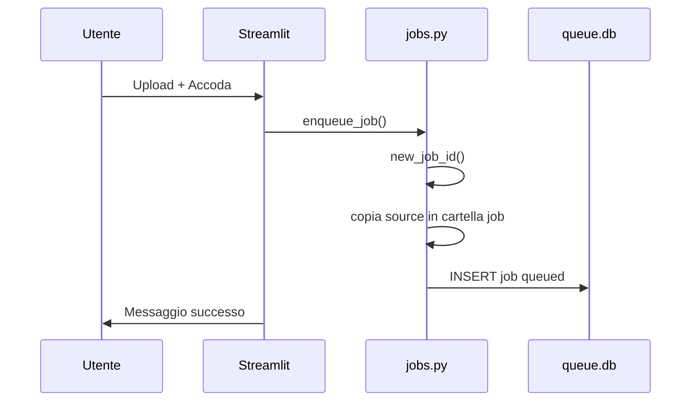
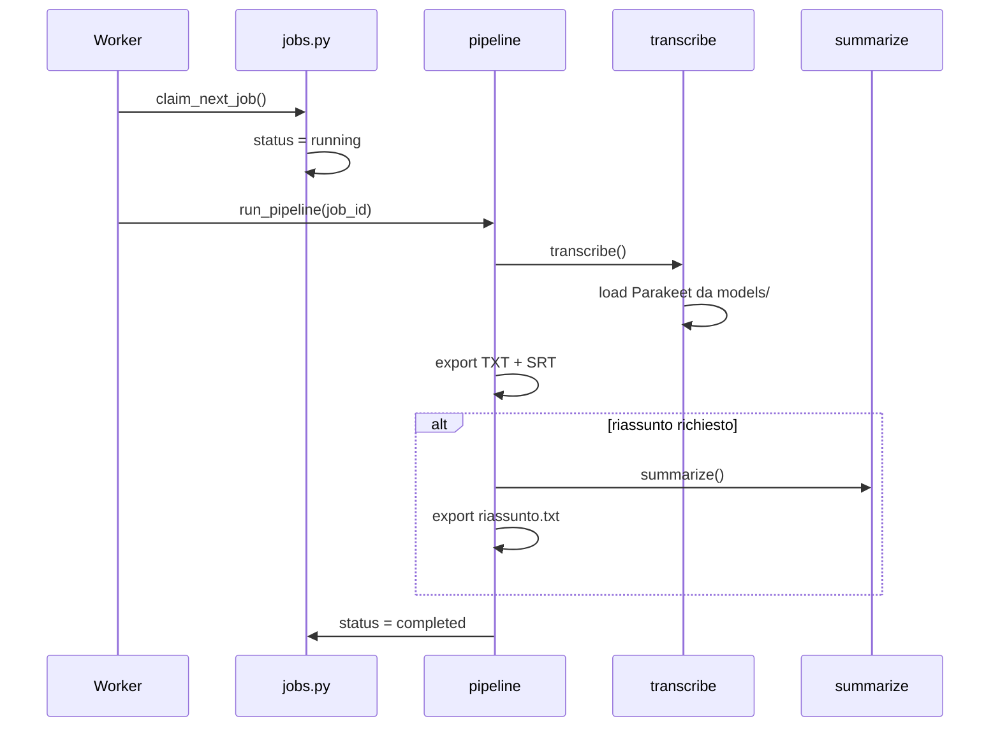

# Flusso dati

## Accodamento (UI o CLI)

## Elaborazione

## Lettura risultati (UI)

1. `load_index()` → lista job da SQLite
2. Utente seleziona job → `get_job(id)`
3. `job.txt_path().read_text()` → contenuto da disco

Il DB **non** contiene il testo trascritto — solo metadati e path.

## Variabili path

| Variabile | Default locale | Docker |
|-----------|----------------|--------|
| `SBOBINATOR_DATA` | `./data` | `/data` |
| `NEMO_CACHE_DIR` | `./models` | `/models` |

Vedi [Configurazione](../reference/configuration.md).
