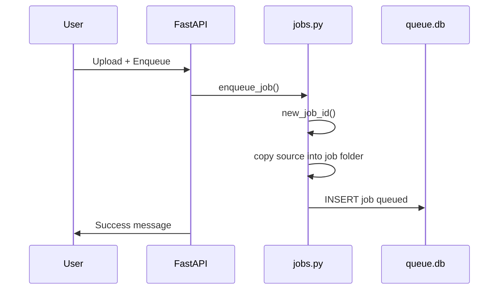
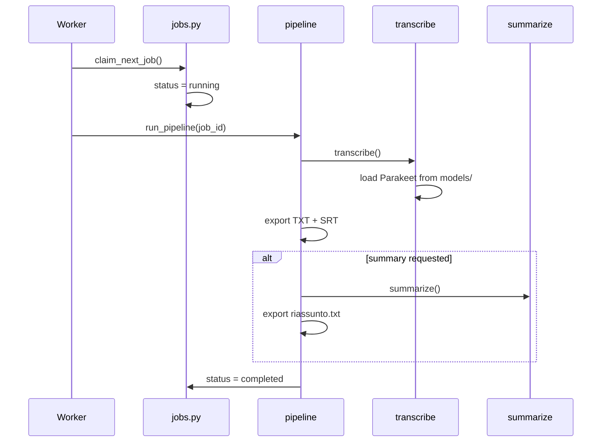

# Data flow

## Enqueueing (UI or CLI)

## Processing

## Reading results (UI)

1. `load_index()` → job list from SQLite
2. User selects job → `get_job(id)`
3. `job.txt_path().read_text()` → content from disk

The database **does not** store transcribed text — only metadata and paths.

## Path variables

| Variable | Local default | Docker |
|----------|---------------|--------|
| `SBOBINATOR_DATA` | `./data` | `/data` |
| `NEMO_CACHE_DIR` | `./models` | `/models` |

See [Configuration](../reference/configuration.md).
