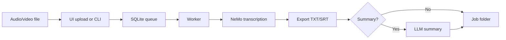

# Overview

Sbobinator is designed for two usage modes:

## 1. Development and desktop use (native Python)

- Windows, Linux, or macOS with Python 3.12+
- Install with `scripts/install_local.py`
- Models in `models/` at the project root
- Data in `data/input/` and `data/output/`
- Start with `start.bat` (Windows) or `sbobina ui`

**Best for:** testing, personal use, benchmarks on your own machine.

## 2. Production (Docker)

- Linux image with dependencies and **ASR models baked into the build**
- Only the `data/` folder mounted from the host (input + output)
- No download on first container start

**Best for:** mini PCs, servers, repeatable deployment.

## Typical user flow

## Current version

**0.3.0** — SQLite job queue, worker in a separate process, job folders `YYYYMMDD_HHMMSS_filename`.

## Next steps

1. [Installation](installation.md)
2. [Quick start](quickstart.md)
3. [Download models](models.md)
