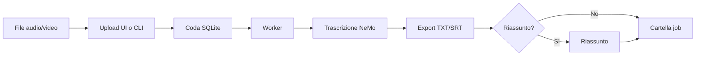

# Panoramica

Sbobinator è pensato per due modalità d'uso:

## 1. Sviluppo e uso desktop (Python nativo)

- Windows, Linux o macOS con Python 3.12+
- Installazione con `scripts/install_local.py`
- Modelli in `models/` nella root del progetto
- Dati in `data/input/` e `data/output/`
- Avvio con `start.bat` (Windows) o `sbobina ui`

**Ideale per:** prove, uso personale, benchmark sulla propria macchina.

## 2. Produzione (Docker)

- Immagine Linux con dipendenze, modelli ASR e mT5 **già nel build**
- Solo la cartella `data/` montata dal host (input + output)
- Nessun download al primo avvio del container

**Ideale per:** mini PC, server, deploy ripetibile.

## Flusso utente tipico

## Versione corrente

**0.3.0** — coda job SQLite, worker in processo separato, cartelle job `YYYYMMDD_HHMMSS_nomefile`.

## Prossimi passi

1. [Installazione](installation.md)
2. [Avvio rapido](quickstart.md)
3. [Download modelli](models.md)
